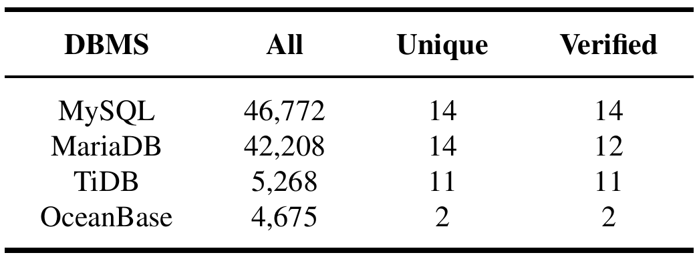
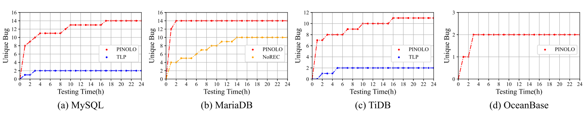
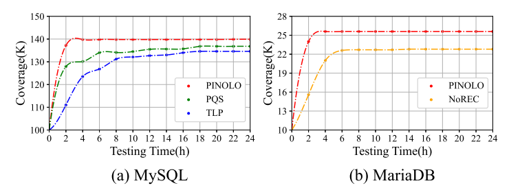
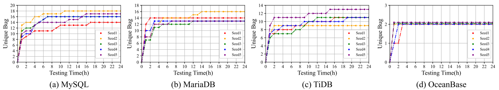

# Reproduce

The reproduction requires a large amount of CPU, memory, and disk resources. For example, for bug deduplication, you need to deploy 420 different versions of DBMSs on your machine. Therefore, please conduct the experiment on our server.

```shell
ssh -p 7005 aosp@108.61.156.164
cd /home/aosp/projects/database/reproduce
```

> There are other important data on our server, please do not leave this directory! :-)

**Note that, due to concurrency and some random features of DBMS, the results may not be reproduced exactly. We will provide results with an allowed tolerance. **

## Evaluation1

```shell
cd E1
```

### Overview

This is the reproduction steps of our first experiment, which corresponds to section **5.2** (**Effectiveness of** **PINOLO**) of our paper.

Our experimental results are as follows:



In the following reproduction steps, you will see that:

1. During a 24-hour testing period, our tool PINOLO can find 46,772 / 42,208 / 5,268 / 4,675 bugs in MySQL / MariaDB / TiDB / OceanBase.
2. After deduplication, there are 14 / 14 / 11 / 2 unique bugs in MySQL / MariaDB / TiDB / OceanBase.
3. 14 / 12 / 11/ 2 bugs have been comfirmed by developers.

### Step1 All bugs

We have downloaded and installed PINOLO from https://github.com/qaqcatz/impomysql, see the directory `impomysql`.

For convenience, we provided 3 scripts (**testmysql.sh**, **testmariadb.sh**, **testtidb.sh**) that can automatically deploy and test MySQL, MariaDB and TiDB for 24 hours, just run them without any arguments.

> However, for OceanBase, it will attempt to occupy all disk space (this is a configuration bug, see: https://github.com/oceanbase/oceanbase/issues/1307), which leads to a very high frequency of crashes when tested with other DBMSs. Therefore, it is recommended to deploy and test OceanBase alone with the following commands:
>
> ```shell
> cd impomysql
> docker run -itd --name oceanbasetest -p 2881:2881 oceanbase/oceanbase-ce:4.0.0.0
> ./impomysql taskpool ./resources/testoceanbase.json
> ```

After testing, you can find the results in **impomysql/output/mysql/result.json, impomysql/output/mariadb/result.json,impomysql/output/tidb/result.json,impomysql/output/oceanbase/result.json**. Take MySQL as an example, whose result.json is:

```json
{"startTime":"2023-05-06 18:01:00.203957227 +0800 CST m=+0.004659895","totalTaskNum":848,"finishedTaskNum":845,"errorTaskNum":0,"errorTaskIds":[],"bugsNum":41613,"bugTaskIds":[...],"endTime":"2023-05-07 18:01:09.553078995 +0800 CST m=+86409.353781617"}
```

`"bugsNum":41613` means that a total of 41613 bugs were found during MySQL's testing.

> If a DBMS crashes during testing, we will use `keeper` to restart it, and save the results in `impomysql/output-1`, `impomysql/output-2`, ...
>
> You should add them up to get the total number of logical bugs for each DBMS in our paper.

### Step2 Unique bugs

For convenience, we provided 3 scripts (**dedupmysql.sh**, **dedupmariadb.sh**, **deduptidb.sh**) that can automatically deduplicate bugs in MySQL, MariaDB and TiDB, each script takes about 12 hours to complete, just run them without any arguments.

We will try to find the bug-including-version of each bug with the help of ` dbdeployer`, which will automatically deploy the historical versions of each DBMS.  Two bugs are considered the same if their bug-inducing versions are the same. 

> As mentioned above,  OceanBase frequently crashes when coexists with antoher DBMS,  even another OceanBase. Therefore, it is recommended to  deduplicate bugs in OceanBase with the following commands manually:
>
> ```shell
> cd impomysql
> ./impomysql ckstable taskpool ./resources/testoceanbase.json 32 10
> ./impomysql sqlsim taskpool ./resources/testoceanbase.json 32
> # Fortunately, OceanBase only has 4 open source versions.
> docker run -itd --name oceanbasetest -p 2881:2881 oceanbase/oceanbase-ce:4.0.0.0
> ./impomysql affversion taskpool ./resources/testoceanbase.json 16 2881 4.0.0.0
> docker rm -f oceanbasetest
> docker run -itd --name oceanbasetest -p 2881:2881 oceanbase/oceanbase-ce:3.1.4
> ./impomysql affversion taskpool ./resources/testoceanbase.json 16 2881 3.1.4
> docker rm -f oceanbasetest
> docker run -itd --name oceanbasetest -p 2881:2881 oceanbase/oceanbase-ce:3.1.3
> ./impomysql affversion taskpool ./resources/testoceanbase.json 16 2881 3.1.3
> docker rm -f oceanbasetest
> docker run -itd --name oceanbasetest -p 2881:2881 oceanbase/oceanbase-ce:3.1.2
> ./impomysql affversion taskpool ./resources/testoceanbase.json 16 2881 3.1.2
> docker rm -f oceanbasetest
> ./impomysql affclassify ../dbdeployer/dbdeployer ../dbdeployer/ob.json ./resources/testoceanbase.json
> ```

After deduplication, you can find the results in **impomysql/output/mysql/affclassify, impomysql/output/mariadb/affclassify,impomysql/output/tidb/affclassify,impomysql/output/oceanbase/affclassify**. Each directory under `affclassify` represents a unique bug. You can get the total number of unique bugs in our paper by counting the number of directories under each `affclassify`.

### Step3 Verified

We provided a github page (https://github.com/qaqcatz/impomysql_bugreports) to show the details of our  logical bugs (41),  including the confirmation status of developers (39).

## Evaluation2

```shell
cd E2
```

### Overview

This is the reproduction steps of our first experiment, which corresponds to section **5.3** (**Comparisons on Detecting Logical Bugs**) of our paper.

Our experimental results are as follows:





In the following reproduction steps, you will see that:

* During a 24-hour testing period, PQS can not find any bugs, NoREC can find 10 bugs in MariaDB, TLP can find 2 / 2 bugs in MySQL / TiDB.
* The code coverage of PINOLO is higher than PQS, NoREC and TLP.

### Step1 Logical bug detection

Note that, if you do not want to reproduce this experiment, we have provided the experimental results in **result2/MySQL_TLP_WHERE_40001/affclassify, result2/MariaDB_NOREC_40003/affclassify, result2/tidb_QUERY_PARTITIONING_40004/affclassify**. Each directory under `affclassify` represents a unique bug. You can get the total number of unique bugs in our paper by counting the number of directories under each `affclassify`.

Due to the large number of false positives in PQS, NoREC, and TLP(https://github.com/sqlancer/sqlancer/issues/569), we had to invest a considerable amount of manual effort to filter them out. If you want to reproduce this experiment, please follow these steps manually:

1. Install SQLancer(https://github.com/sqlancer/sqlancer)

2. Using SQLancer to test these DBMS:oracle: 

   * MariaDB:NoREC 
   * MySql:PQS, 
   * MySql:TLP_WHERE, 
   * OceanBase:NoREC, 
   * OceanBase:PQS, 
   * OceanBase:TLP_WHERE, 
   * Tidb:QUERY_PARTITIONING.

    The parameters are as follows:

   ```shell
   --timeout-seconds 86400
   --random-seed 123456  
   --num-tries 100000  
   --num-threads 4 
   ```

3. Filter the results in 2 rounds, see the directory `scrip`. `SqlFilter.py` is for round 1, others are for round 2.

4. Then, we will find the bug-including version of each bug.  We think that two bugs are the same bug if their bug-including-versions are the same. see `affversion`, `affclassif` for more details. If you have used impomysql (https://github.com/qaqcatz/impomysql), you will easily understand these two modules.

If everything is ok, the filtering results should be similar to the following table:

|                              | MariaDB:NoRec | MySql:PQS | MySql:TLP_WHERE | OceanBase:NoRec | OceanBase:PQS | OceanBase:TLP_WHERE | Tidb:QUERY_PARTITIONING |
| ---------------------------- | :------------ | :-------- | :-------------- | :-------------- | :------------ | :------------------ | :---------------------- |
| orginal_result(include -cur) | 200000        | 4960      | 100896          | 1387            | 80            | 856                 | 1950                    |
| first round filter           | 418           | 0         | 8               | 2               | 4             | 6                   | 1658                    |
| second  round filter         | 209           | 0         | 8               | 0               | 0             | 0                   | 322                     |
| unique bugs                  | 10            | 0         | 2               | 0               | 0             | 0                   | 2                       |

### Step2 Code coverage

#### Mysql-TLP

```shell
# Enter the docker container
docker exec -it mysql_tlp /bin/bash
# Change directory
cd /home/MYSQL_TLP
# Execute
python3 MysqlTlpCov.py
# Wait for the execution to finish, the result is in the directory `cov`. There are 21 subdirectories named 1~21 in `cov`. You can get the final result in the last subdirectory `21`:
cd ./cov/21
cat result.txt
```

#### Mysql-PQS

```shell
# Enter the docker container
docker exec -it mysql_pqs /bin/bash
# Change directory
cd /home/MYSQL_PQS
# Execute
python3 MysqlPqsCov.py
# Wait for the execution to finish, the result is in the directory `cov`. There are 21 subdirectories named 1~21 in `cov`. You can get the final result in the last subdirectory `21`:
cd ./cov/21
cat result.txt
```

#### Mysql-PINOLO

```shell
# Enter the docker container
docker exec -it mysql_our /bin/bash
# Change directory
cd /home/MYSQL_OUR
# Execute
python3 MysqlOur.py
# Wait for the execution to finish, the result is in the directory `cov`. There are 21 subdirectories named 1~21 in `cov`. You can get the final result in the last subdirectory `21`:
cd ./cov/21
cat result.txt
```

#### Mariadb-NOREC

```shell
# Enter the docker container
docker exec -it mariadb /bin/bash
# Change user and directory
su db
cd ~/Mariadb
# Execute
python3 mariaCov.py
# Wait for the execution to finish, the result is in the directory `cov`. There are 20 subdirectories named 1~20 in `cov`. You can get the final result in the last subdirectory `20`:
cd ./cov/20
cat result.txt
```

#### Mariadb-PINOLO

```shell
# Enter the docker container
docker exec -it mariadb_our /bin/bash
# Change user and directory
su db
cd ~/Mariadb_OUR
# Execute
python3 mariadb_our.py
# Wait for the execution to finish, the result is in the directory `cov`. There are 20 subdirectories named 1~20 in `cov`. You can get the final result in the last subdirectory `20`:
cd ./cov/20
cat result.txt
```

## Evaluation3

```shell
cd E3
```

### Overview

This is the reproduction steps of our third experiment, which corresponds to section **5.4** ( **Impacts of The Seed Query Generation**) of our paper.

Our experimental results are as follows:



In the following reproduction steps, you will see that within a 24-hour testing period, Seed1 / Seed2 / Seed3 / Seed4 / Seed5 can

* detect 14 / 18 / 16 / 16 / 17 bugs for MySQL,
* detect 14 / 16 / 13 / 13 / 13 bugs for MariaDB,
* detect 11 / 9 / 11 / 11 / 13 bugs for TiDB,
* detect 2 / 2 / 2 / 2 / 2 bugs for OceanBase.

### Step

The reproduction steps of evaluation 3 are similar to that of evaluation 1. We only need to change the random seeds of evaluation 1 and repeat the experiment for 5 times.

For convenience, we provided 3 scripts (**testmysql.sh**, **testmariadb.sh**, **testtidb.sh**) that can automatically deploy and test MySQL, MariaDB and TiDB for 24 hours. Different from evaluation 1, you can provide arguments to specify different random seeds. Take MySQL as an example, you can use testmysql.sh / testmysql.sh 1 / testmysql.sh 2 / testmysql.sh 3 / testmysql.sh 4 to run the seed1(default seed) / seed2 / seed3 / seed4 / seed5. 

> In the next reproduction steps, we will skip OceanBase. Because OceanBase needs to be deployed 5 times during testing and 20 times (4 versions * 5) during deduplication,  and any disk occupancy issues need to be manually handling, which consumes a significant of manual efforts. Therefore,  we will skip OceanBase here.

After testing, we provided 3 scripts (**dedupmysql.sh**, **dedupmariadb.sh**, **deduptidb.sh**) that can automatically deduplicate bugs in MySQL, MariaDB and TiDB, each script takes about 60 hours to complete, just run them without any arguments. 

After deduplication, you can find the results in **impomysql/outputX/mysql/affclassify, impomysql/outputX/mariadb/affclassify,impomysql/outputX/tidb/affclassify,impomysql/outputX/oceanbase/affclassify (seed1: X="", seed2: X=1, seed3: X=2, seed4: X=3, seed5: X=4)**. Each directory under `affclassify` represents a unique bug. You can get the total number of unique bugs in our paper by counting the number of directories under each `affclassify`.